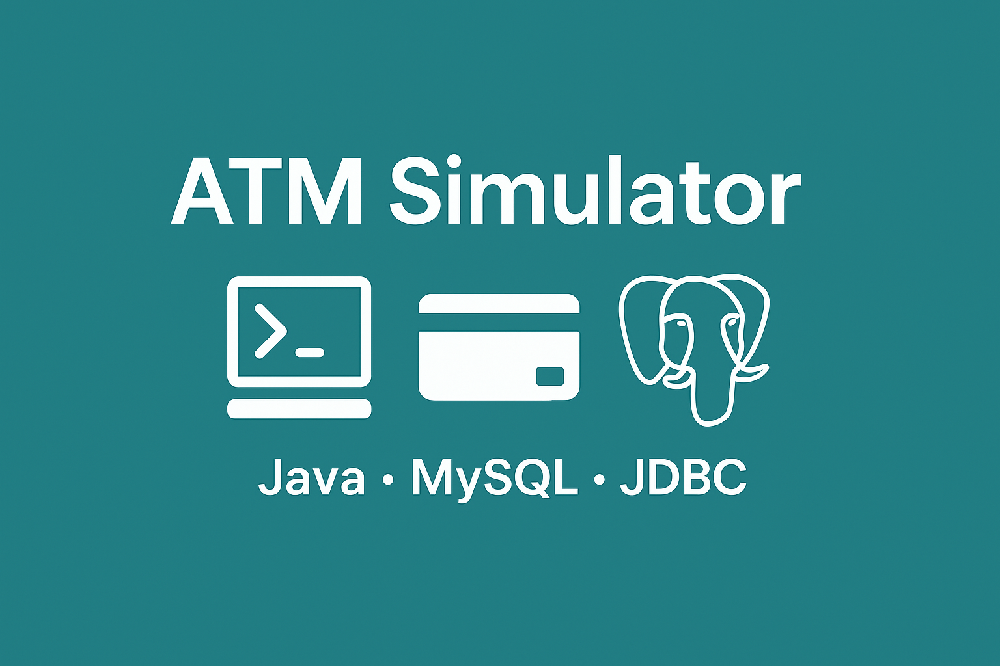

# ATM Simulator

  

A simple ATM simulator developed using Java and MySQL. It simulates basic ATM operations like user registration, login, balance management, deposits, withdrawals, and transaction history.

### Tools & Technologies:

* **Java**: Programming language used for the application.
* **MySQL**: Database for storing user and transaction data.
* **JDBC**: Used to connect Java to MySQL.

### Features:

1. **User Registration**: Register with a username, 4-digit PIN, and get an Account ID.
2. **Login System**: Log in using your Account ID and PIN.
3. **Balance Management**: View balance, deposit, and withdraw funds.
4. **Transaction History**: Logs all deposits and withdrawals.
5. **PIN Attempt Limitation**: Locks account after 3 failed login attempts.

### How to Use:

1. **Run the Application**: Start the program to view the main menu.
2. **Register**: Enter a username and PIN to create an account and receive an Account ID.
3. **Login**: Use your Account ID and PIN to log in.
4. **ATM Menu**: View account details, deposit/withdraw money, or log out.

### Installation:

1. **Set up MySQL**: Create the database and tables.
2. **Configure Connection**: Update database credentials in the Java code.
3. **Run the Application**: Compile and run the Java program.

